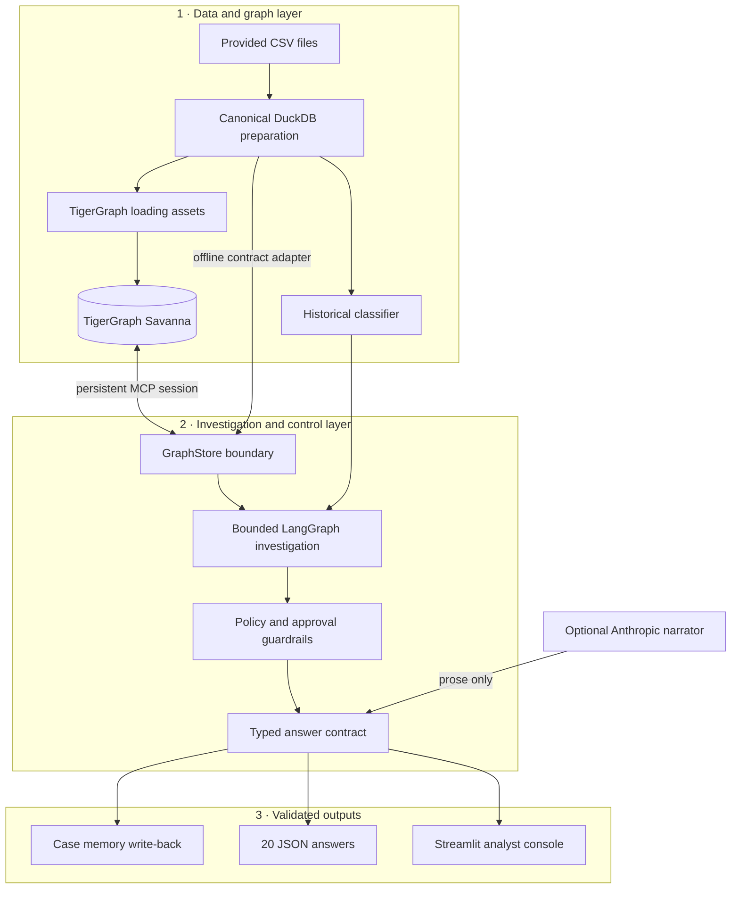

# Sentinel Graph — Agentic Fraud Investigation

An evidence-first fraud investigation agent for the TigerGraph Hacker House Goa benchmark. It reconstructs canonical cards, learns from 5,565 closed cases, queries graph context through TigerGraph MCP, follows the supplied approval policy, writes case memory back to the graph, and emits the required 20 schema-validated answers.

## What is included

- A bounded workflow with deterministic evidence simulation and policy guardrails.
- TigerGraph schema, loading-job, installed-query, vector-search, and MCP adapters.
- A leakage-aware DuckDB development backend that preserves as-of-time investigation semantics.
- A sparse mixed-type fraud classifier trained only on the supplied closed-case history.
- Twenty JSON answers in `cases/`, validated against strict Pydantic and policy invariants.
- A Streamlit analyst console, architecture notes, runbook, and submission copy.

## Quick start

Requires Python 3.12 or newer.

```powershell
python -m pip install -e ".[dev,tigergraph]"
Copy-Item .env.example .env
python -m fraud_agent profile --source "Drive Files"
python -m fraud_agent prepare --source "Drive Files"
python -m fraud_agent train --source "Drive Files"
python -m fraud_agent batch --source "Drive Files" --backend local --no-llm
python -m fraud_agent validate --cases-dir cases --expected-count 20
python -m streamlit run app.py
```

`Drive Files/`, `.env`, the DuckDB database, and trained model are ignored intentionally. The source benchmark is never copied into Git.

## Savanna / TigerGraph

Populate `TG_HOST`, `TG_GRAPHNAME`, and either `TG_SECRET` (the recommended Savanna Database Secret) or `TG_API_TOKEN` (an already-minted REST++ bearer token) in `.env`. Then deploy and populate the graph through one persistent MCP session:

```powershell
python -m fraud_agent graph-assets --out graph --graph-name FraudGraph
python -m fraud_agent graph-prepare --source "Drive Files"
python -m fraud_agent graph-deploy --assets graph --replace
python -m fraud_agent graph-load
python -m fraud_agent graph-knowledge --source "Drive Files/README.md"
python -m fraud_agent batch --source "Drive Files" --backend mcp
```

`--replace` permanently drops the configured graph before recreating it; use it only when replacing an incorrect or disposable schema. Omit it for a fresh database with no conflicting graph.

Without those credentials, `--backend auto` deliberately falls back to the contract-compatible DuckDB graph adapter. See [the runbook](docs/runbook.md) for deployment details and [the architecture](docs/architecture.md) for the trust boundaries.

## Verification

```powershell
python -m ruff check .
python -m mypy src
python -m pytest
python -m fraud_agent validate --cases-dir cases --expected-count 20
```


***

# Architecture

Sentinel Graph separates evidence, decisions, and narration so that an LLM cannot silently alter a fraud outcome.



## Trust boundaries

The workflow accepts only graph-query results and the trained classifier as decision inputs. All graph reads use the case's `opened_at` timestamp, preventing later activity from leaking into an earlier investigation. The risk score is a feature rather than a verdict.

The optional narrator receives an already validated answer. Its output is restricted to `case.summary` and, when present, `sar.narrative`; validation and deterministic fallback prevent prose generation from changing the decision.

## Graph model

Vertices cover customers, cards, transactions, device profiles, email domains, billing regions, cases, and knowledge chunks. Edges model ownership, transaction history, device/email/region origins, temporal sequence, case involvement, connected cards, and citations. New investigations are written as `FraudCase` vertices with `INVOLVES`, `CONNECTED_TO`, and `CITES_PRIOR_CASE` edges.

## Investigation lifecycle

1. Retrieve the flagged transaction, card history, prior cases, device neighbors, and policy chunks.
2. Detect explainable sequences and calculate a calibrated probability from historical, graph, and source signals.
3. Ask for evidence only in the uncertain band and record the simulated assumption.
4. Recompute the recommendation, route approvals, determine SAR eligibility, and stop at a policy condition.
5. Validate the complete answer, then persist case memory and write the JSON artifact.


***
# Runbook

## Local benchmark run

1. Place the supplied files in `Drive Files/`; do not rename or commit that directory.
2. Install the package with `python -m pip install -e ".[dev,tigergraph]"`.
3. Run `python -m fraud_agent profile --source "Drive Files"`. Expected counts are 590,742 transactions, 144,432 identity rows, 5,565 closed cases, and 20 benchmark cases.
4. Run `python -m fraud_agent prepare --source "Drive Files"` and `python -m fraud_agent train --source "Drive Files"`.
5. Generate answers with `python -m fraud_agent batch --source "Drive Files" --backend local --no-llm`.
6. Validate with `python -m fraud_agent validate --cases-dir cases --expected-count 20`.
7. Launch the console with `python -m streamlit run app.py`.

## Savanna deployment

Create a Savanna workspace and graph, copy `.env.example` to `.env`, and provide `TG_HOST`, `TG_GRAPHNAME`, plus `TG_SECRET` from **Database Secrets**. `TG_API_TOKEN` is only for a REST++ bearer token that has already been minted from a database secret; do not put a Savanna organization API key there.

Run `graph-assets`, inspect the generated GSQL, then execute `graph-prepare`, `graph-deploy`, `graph-load`, and `graph-knowledge` in that order. `graph-prepare` streams the canonical DuckDB data into compact normalized CSVs under `.artifacts/graph-load`; `graph-load` uploads every vertex and edge file through `load_fraud_graph`; `graph-knowledge` creates deterministic 384-dimensional benchmark-document embeddings. Use `graph-deploy --replace` only to replace an incorrect disposable schema because it permanently drops the configured graph first.

The MCP process is kept open for a whole batch, so connection setup is not repeated per query. A case write is idempotent within the session. If credentials are missing, explicit MCP selection fails instead of silently claiming a live graph write.

## LLM narration

Set `ANTHROPIC_BASE_URL`, `ANTHROPIC_AUTH_TOKEN`, and `ANTHROPIC_MODEL` to enable narration. Use `--no-llm` for a deterministic run. Endpoint failure or malformed JSON falls back safely.

## Troubleshooting

- Missing transaction: rebuild `.artifacts/fraud.duckdb` from the unmodified source files.
- TigerGraph query failure: confirm the graph name, install all queries in `graph/queries.gsql`, and verify the token has graph access.
- Model warning or stale behavior: delete only `.artifacts/fraud-model.joblib` and rerun `train`.
- Invalid answer: run the validator; it reports filename, schema, action-route, SAR, and exposure inconsistencies.
- Dashboard has no cases: generate the `cases/HHG-*.json` files first.

## Data safety

Before any commit, run `git status --short --ignored` and confirm `Drive Files/`, `.env`, `.artifacts/`, databases, and models are ignored. Never add them with `git add -f`.
