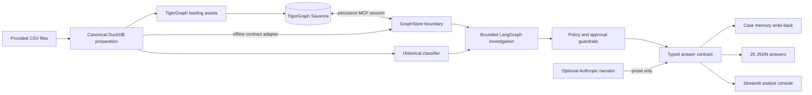

# Architecture

Sentinel Graph separates evidence, decisions, and narration so that an LLM cannot silently alter a fraud outcome.

## Trust boundaries

The workflow accepts only graph-query results and the trained classifier as decision inputs. All graph reads use the case's `opened_at` timestamp, preventing later activity from leaking into an earlier investigation. The risk score is a feature rather than a verdict.

The optional narrator receives an already validated answer. Its output is restricted to `case.summary` and, when present, `sar.narrative`; validation and deterministic fallback prevent prose generation from changing the decision.

## Graph model

Vertices cover customers, cards, transactions, device profiles, email domains, billing regions, cases, and knowledge chunks. Edges model ownership, transaction history, device/email/region origins, temporal sequence, case involvement, connected cards, and citations. New investigations are written as `FraudCase` vertices with `INVOLVES`, `CONNECTED_TO`, and `CITES_PRIOR_CASE` edges.

## Investigation lifecycle

1. Retrieve the flagged transaction, card history, prior cases, device neighbors, and policy chunks.
2. Detect explainable sequences and calculate a calibrated probability from historical, graph, and source signals.
3. Ask for evidence only in the uncertain band and record the simulated assumption.
4. Recompute the recommendation, route approvals, determine SAR eligibility, and stop at a policy condition.
5. Validate the complete answer, then persist case memory and write the JSON artifact.
